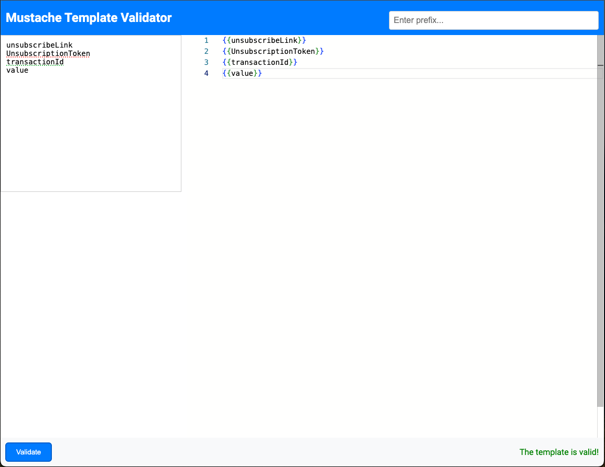
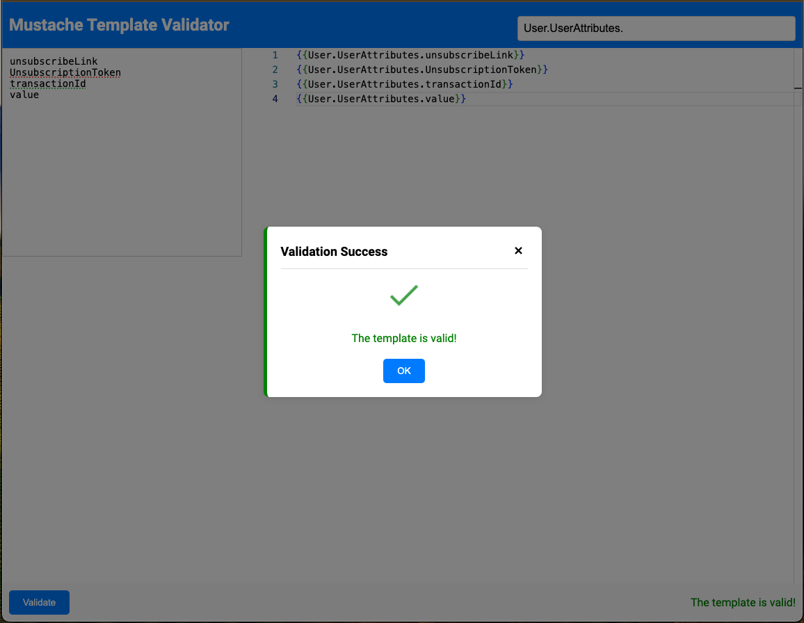
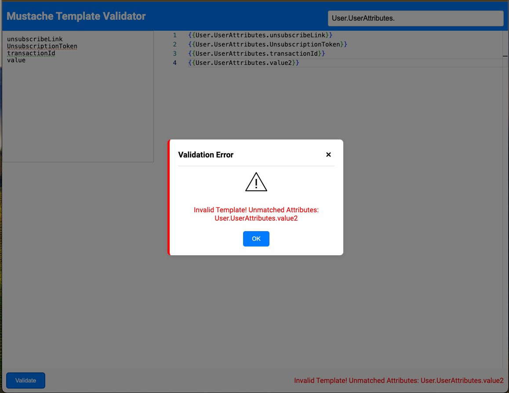

# Mustache Template Validator

A React application that validates HTML templates using Mustache syntax against a list of attributes. This application features a Monaco Editor for editing templates and a modal to display validation results.

## Table of Contents

- [Features](#features)
- [Installation](#installation)
- [Usage](#usage)
- [Screenshots](#screenshots)
- [File Structure](#file-structure)
- [Running Unit Tests](#running-unit-tests)
- [Running E2E Tests with Cypress](#running-e2e-tests-with-cypress)
- [Continuous Integration with GitHub Actions](#continuous-integration-with-github-actions)
- [Contributing](#contributing)
- [License](#license)

## Features

- **Mustache Template Validation**: Validates templates against user-defined attributes.
- **Monaco Editor**: Provides a powerful editor for writing templates.
- **Modal Alerts**: Displays validation results in a modal dialog.
- **Responsive Design**: Adapts to various screen sizes, including mobile and tablet.

## Installation

1. **Clone the Repository**:

   ```bash
   git clone git@github.com:trustlreis/mustache-template-validator.git
   ```

2. **Navigate to the Project Directory**:

   ```bash
   cd mustache-template-validator
   ```

3. **Install Dependencies**:

   ```bash
   npm install
   ```

## Usage

1. **Start the Development Server**:

   ```bash
   npm start
   ```

2. **Open the Application**:

   Open your browser and visit `http://localhost:3000`.

3. **Use the Application**:
   - Enter a prefix and attributes separated by commas or new lines.
   - Write your Mustache template in the Monaco Editor.
   - Click the "Validate" button to check the template.

## Screenshots

Here are some screenshots showcasing the application's UI and features:

### Application Interface Without Prefix



### Template Syntax Validation - Success



### Template Syntax Validation - Error



## File Structure

The project is organized as follows:

```plaintext
mustache-template-validator/
│
├── .github/
│   └── workflows/
│       └── ci.yml                   # GitHub Actions workflow for CI/CD
│
├── cypress/
│   ├── e2e/
│   │   └── mustacheValidation.cy.js # Cypress E2E test spec file
│   ├── fixtures/
│   ├── support/
│   │   ├── commands.js              # Custom Cypress commands (optional)
│   │   └── e2e.js                   # Cypress support configuration
│   └── cypress.config.js            # Cypress configuration file
│
├── public/
│   ├── favicon.svg                  # Favicon for the app
│   ├── index.html                   # Main HTML file for React app
│   └── manifest.json                # Web app manifest
│
├── src/
│   ├── components/
│   │   └── Modal.js                 # Modal component
│   ├── styles/
│   │   └── App.css                  # Main CSS styles
│   ├── App.js                       # Main React component
│   ├── App.test.js                  # Unit tests for App component
│   ├── index.js                     # Entry point for React app
│   ├── reportWebVitals.js           # Performance metrics (optional)
│   └── setupTests.js                # Jest test setup file
│
├── .gitignore                       # Ignored files for git
├── LICENSE                          # License file
├── package.json                     # NPM package configuration
├── package-lock.json                # Lockfile for NPM dependencies
├── README.md                        # Project documentation
├── screenshot-syntax-error.png      # Screenshot for syntax error example
├── screenshot-without-prefix.png    # Screenshot for interface without prefix
└── screenshot-syntax-ok.png         # Screenshot for successful validation
```

## Running Unit Tests

Unit tests are handled using [Jest](https://jestjs.io/) and [React Testing Library](https://testing-library.com/).

1. **Run Unit Tests**:

   ```bash
   npm test
   ```

   This command runs the test suite and watches for changes.

2. **Test Cases**:

   - **Component Rendering**: Ensures all UI elements are correctly rendered.
   - **Template Validation**: Tests both valid and invalid template scenarios.
   - **Modal Behavior**: Verifies modal displays the correct validation results.

### Test Coverage

For test coverage details, you can use:

```bash
npm test -- --coverage
```

This will generate a detailed report of code coverage.

## Running E2E Tests with Cypress

Cypress is used for end-to-end testing, simulating real user interactions.

1. **Install Cypress**:

   ```bash
   npm install --save-dev cypress
   ```

2. **Open Cypress**:

   ```bash
   npm run cypress:open
   ```

3. **Run E2E Tests**:

   Inside the Cypress Test Runner, select the `mustacheValidation.cy.js` spec file to execute the tests.

4. **Cypress Test Cases**:

   - **Render Tests**: Confirms all elements are visible.
   - **Validation Tests**: Checks correct and incorrect template validation.
   - **Modal Interaction**: Tests modal visibility and content accuracy.

5. **Cypress Configuration**:

   Update `cypress.config.js` as needed:

   ```javascript
   const { defineConfig } = require('cypress');

   module.exports = defineConfig({
     e2e: {
       baseUrl: 'http://localhost:3000',
       specPattern: 'cypress/e2e/**/*.cy.js',
       viewportWidth: 1000,
       viewportHeight: 660,
       retries: {
         runMode: 2,
         openMode: 0,
       },
     },
   });
   ```

## Continuous Integration with GitHub Actions

This project uses GitHub Actions for CI/CD, running unit tests automatically on pushes and pull requests.

1. **GitHub Actions Workflow**:

   Located at `.github/workflows/ci.yml`:

   ```yaml
   name: Run Unit Tests

   on:
     push:
       branches:
         - main
     pull_request:
       branches:
         - main

   jobs:
     test:
       runs-on: ubuntu-latest

       strategy:
         matrix:
           node-version: [16, 18, 20]

       steps:
         - name: Checkout repository
           uses: actions/checkout@v3

         - name: Set up Node.js
           uses: actions/setup-node@v3
           with:
             node-version: ${{ matrix.node-version }}

         - name: Install dependencies
           run: npm install

         - name: Run Unit Tests
           run: npm test
   ```

2. **CI/CD Benefits**:

   - **Automated Testing**: Runs tests automatically on each push or pull request, ensuring that code changes don't introduce regressions.
   - **Multi-Version Testing**: Tests across multiple Node.js versions for compatibility.

## Contributing

Contributions are welcome! Please follow these steps:

1. **Fork the Repository**: Create a fork on GitHub.
2. **Clone the Fork**: Clone the fork to your local machine.
3. **Create a Branch**: Create a new feature branch.
4. **Commit Changes**: Make your changes and commit them with descriptive messages.
5. **Push Changes**: Push your changes to your fork.
6. **Open a Pull Request**: Submit a pull request on GitHub.

## License

This project is licensed under the MIT License. See the [LICENSE](LICENSE) file for details.