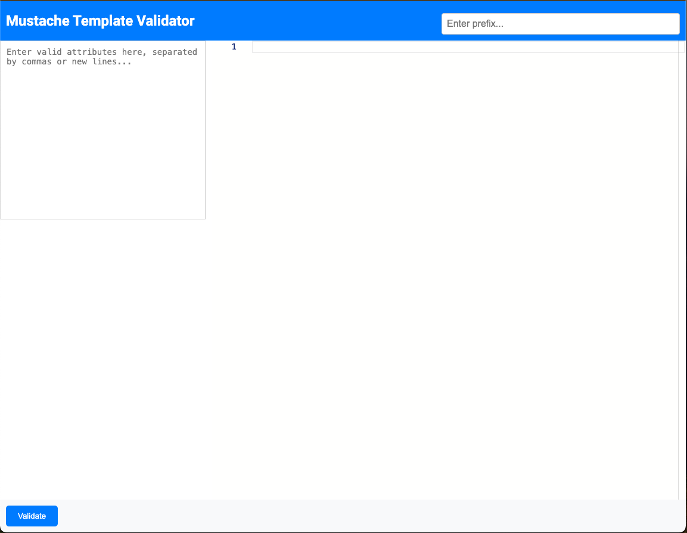

# Mustache Template Validator

This is a React application that allows users to validate Mustache templates against a list of dynamic attributes and a prefix. The app uses Monaco Editor for syntax highlighting and provides real-time feedback on template validity.

## Features

- **Syntax Highlighting**: Utilize Monaco Editor to provide a rich text editing experience with HTML syntax highlighting.
- **Dynamic Attribute Input**: Enter attributes dynamically via a textarea, separated by commas or new lines.
- **Prefix Support**: Add a prefix to attributes to match complex Mustache template structures.
- **Validation Feedback**: Get real-time feedback on whether the template is valid or lists unmatched attributes.

## Screenshots




## Table of Contents

- [Installation](#installation)
- [Usage](#usage)
- [Running Tests](#running-tests)
- [File Structure](#file-structure)
- [Technologies Used](#technologies-used)
- [Contributing](#contributing)
- [License](#license)
- [Contact](#contact)

## Installation

Follow these steps to set up and run the project locally:

1. **Clone the Repository**

   ```bash
   git clone git@github.com:trustlreis/mustache-template-validator.git
   cd mustache-template-validator
   ```

2. **Install Dependencies**

   Make sure you have Node.js and npm installed, then run:

   ```bash
   npm install
   ```

3. **Start the Development Server**

   ```bash
   npm start
   ```

   The application will be available at [http://localhost:3000](http://localhost:3000).

## Usage

1. **Enter Mustache Template**: Use the Monaco Editor to type your Mustache template with placeholders, e.g., `{{user.UserAttribute.Name}}`.

2. **Input Attributes**: Enter attributes in the textarea, separated by commas or new lines, e.g., `Name, Age, Email`.

3. **Set Prefix**: Specify a prefix for the attributes in the input field, e.g., `user.UserAttribute.`.

4. **Validate**: Click the "Validate" button to check if the Mustache template is valid. You will see a success message if all placeholders match the provided attributes and prefix, or an error message listing unmatched attributes.

## Running Tests

### Unit Tests

Unit tests are implemented using Jest and React Testing Library.

Run the tests with:

```bash
npm test
```

### End-to-End Tests

End-to-end tests are implemented using Cypress.

1. **Open Cypress Test Runner**:

   ```bash
   npm run cypress:open
   ```

   This command opens the Cypress test runner, where you can select and run your E2E tests.

2. **Run Cypress Tests in CLI**:

   ```bash
   npm run cypress:run
   ```

   This command runs all Cypress tests in the terminal and provides a report of the results.

## File Structure

```
mustache-template-validator/
│
├── public/
│   ├── index.html
│   └── favicon.ico
│
├── src/
│   ├── components/
│   │   └── CustomEditor.js
│   ├── App.css
│   ├── App.js
│   ├── App.test.js
│   ├── index.js
│   └── reportWebVitals.js
│
├── cypress/
│   ├── integration/
│   │   └── mustacheValidator.spec.js
│   └── support/
│       ├── commands.js
│       └── index.js
│
├── package.json
├── README.md
└── ...
```

- **src/components/CustomEditor.js**: Component for the Monaco Editor setup.
- **src/App.js**: Main application logic.
- **src/App.test.js**: Unit tests for the application.
- **cypress/integration/mustacheValidator.spec.js**: End-to-end tests.

## Technologies Used

- **React**: A JavaScript library for building user interfaces.
- **Monaco Editor**: The code editor that powers Visual Studio Code, used for syntax highlighting.
- **Jest**: A delightful JavaScript Testing Framework with a focus on simplicity.
- **React Testing Library**: For testing React components.
- **Cypress**: A fast, easy, and reliable testing framework for anything that runs in a browser.

## Contributing

Contributions are welcome! Follow these steps to contribute:

1. Fork the repository.
2. Create a new branch (`git checkout -b feature/your-feature`).
3. Make your changes and commit them (`git commit -m 'Add some feature'`).
4. Push to the branch (`git push origin feature/your-feature`).
5. Open a pull request.

## License

This project is licensed under the MIT License - see the [LICENSE](LICENSE) file for details.

## Contact

For any questions, feel free to contact me at [luis.reis@trustly.com](mailto:luis.reis@trustly.com).